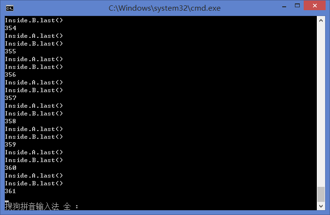

###14353160 李仲诩
###死锁

最终卡死结果如下：

***
####产生死锁的4个必要条件

1、对于某一资源无法共同使用，相互互斥

2、占有的资源无法抢占

3、一个进程在请求另一无法使用的资源的时候一直占有原本正使用的资源

4、循环等到，出现了循环的等待队列

***
####这次试验产生死锁的原因

应该是运行时间的问题,首先按照ppt的代码是会创建一波线程，然后进入一波while，这是假如线程唤醒的时间和while结束的时间这么巧就装上的话，那么类A就会持有自己的资源申请类B的资源，而类B这时跟类A做着一样的事，于是就满足了以上条件，从而出现了思索的现象。

***
####实验感想
这次的实验让我们有重温了一下死锁的条件，让我们又体验一下死锁的情况，让我们对于死锁现象更加警醒了。