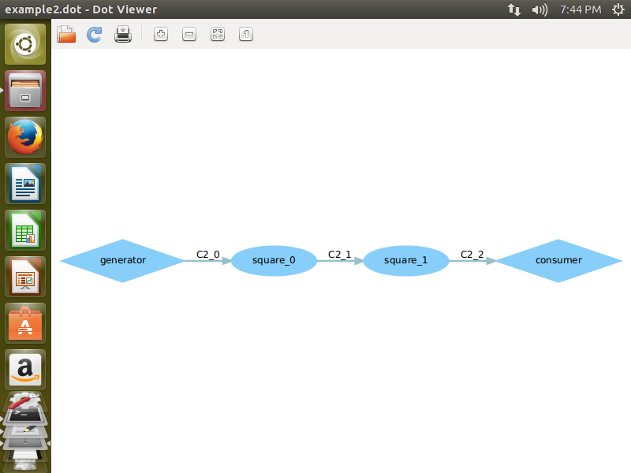

###14353160 李仲诩
***
###Dol实例分析
####1.实验过程
#####example1：

这次我们是对简单的样例example1 & example2进行分析，首先是example1。大致就是通过generator生成参数i,然后通过中间的cubic函数将i作平方运算，然后再传到consumer最后输出出来。

然后我们知道了这个过程以后我们就知道了要到square.c的中间处理的时候进行更改，改成三次方，然后重新编译运行就好了,顺便把中间的函数改名为cubic

下图为example1的dot文件：

————————————————————————————————————————————————————————————————————
#####example2：

然后我们看到example2，在xml文件中我们可以看到一开始定义了一个变量value为3，变量N,然后我们看到在后面这个参数作为一个循环参数来使用了，用于对square与通道间的传输进行三次循环，因此我们只需要把该参数3改为2就可以达到目的了。

下图为example2的dot文件：

***
####2.实验感想

本次的实验让我们比较好的了解了这种函数间传输的结构的使用，其xml的编写，以及循环的方法，让我们对这种编码方式有了比较基础的了解。

