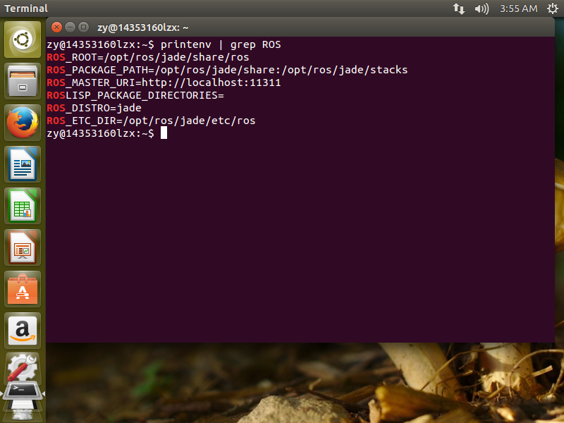
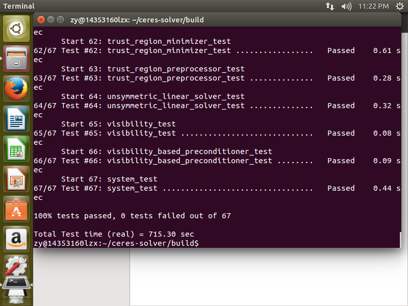
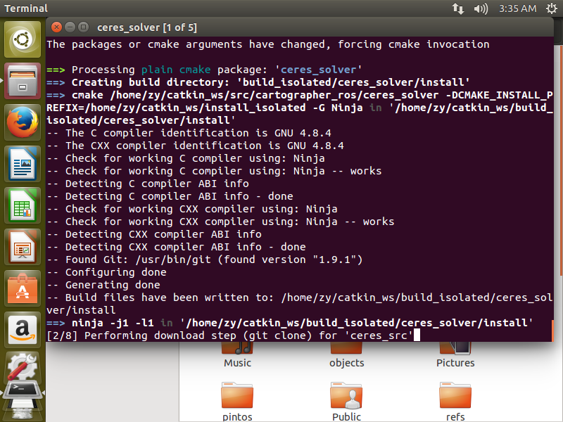

###14353160 李仲诩
###ROS的配置与cartography的配置
####ROS的配置
首先ROS的配置比较简单我们就不详细描述了，基本上跟着流程走就是现在安装的久一点，很快就安装好了，我们就随便截取一张安装结束以后一些关键目录的的图片吧(通过<t style = "font-style:italic">printenv | grep ROS</t>指令)：

***
####cartography的配置
首先是配置环境我们要配置ceres_solver和cartography的环境，首先我们点进教程的环境配置，第一个是ceres_solver的配置，我们按照步骤到clone的那一步然后就发现没办法用git连上Google git的网，于是在那个目标网址晃了半天从上面下了个压缩包下来，然后按照clone下来的差不多的方式进行解压进行后面的步骤，然后经历了比较久的ninja和ninja test以后得到一下结果：

然后是安装cartography，这个跟刚才那个类似，从网站的github clone下文件以后更上面的步骤差不多了，跑完ninja test以后的结果如下：

然后我们就配置完环境了，我就打算按照教程的步骤把后面的example包也下载下来进行一波测试，于是乎我们要按照这流程新建了一下文件夹，然后按照教程引入了一些变量，并来到了倒数第二步，然后跑到（2/8）就fail了，经过仔细的研究发现该指令的这一步，跟前面安装ceres_solver的clone步骤其实是一样的，连网址都一样（连不上），虽然感觉应该可以将前面的环境配置的那些文件弄进去，但是一时没有头绪，不敢轻举妄动，没法完成后面的测试了，这里就衔接一下到（2/8）位置的截图吧：

***
####实验感想
这一次的实验让我们对于ROS的一些配置有了一些了解，并了解了cartography大致配置。